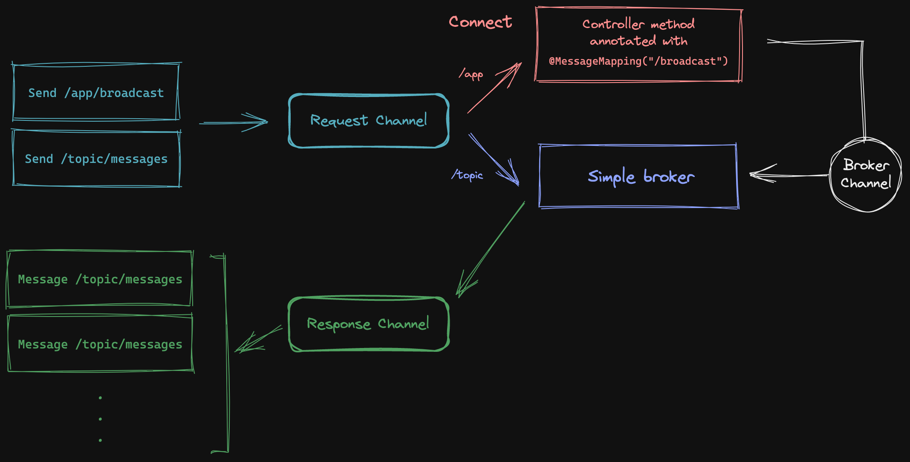

# Spring boot + WebSocket + STOMP

## WebSocket

`websocket` module

- http://localhost:8081/websocket

## WebSocket + STOMP

`stomp` module

- http://localhost:8080/stomp-broadcast

## References
- https://spring.io/guides/gs/messaging-stomp-websocket/
- https://www.dariawan.com/tutorials/spring/